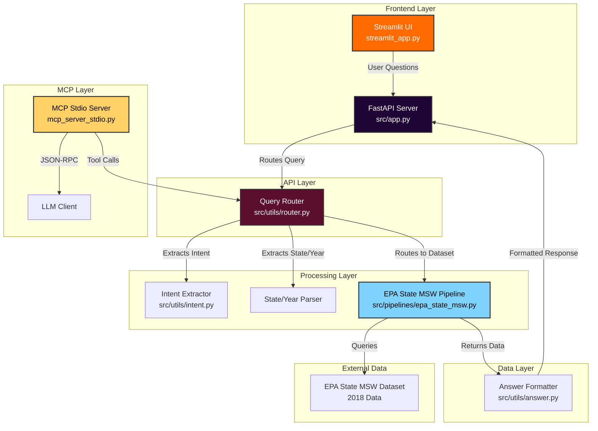

# WasteTrace Architecture

## System Overview

WasteTrace is a municipal waste analytics platform that combines FastAPI backend, Streamlit frontend, and MCP (Model Context Protocol) integration for natural language querying of EPA waste data.

## Architecture Diagram



## Component Details

### 1. Frontend Layer
- **Streamlit UI** (`streamlit_app.py`)
  - User interface with colorful gradient design
  - Accepts natural language questions
  - Displays routing information and formatted answers
  - Runs on `http://localhost:8501`

### 2. API Layer
- **FastAPI Server** (`src/app.py`)
  - RESTful API endpoints
  - `/health` - Health check
  - `/query` - Main query endpoint
  - Runs on `http://127.0.0.1:8000`

### 3. Processing Layer
- **Query Router** (`src/utils/router.py`)
  - Extracts state names from questions
  - Extracts years (2015-2024)
  - Routes to appropriate dataset based on intent
  
- **Intent Extractor** (`src/utils/intent.py`)
  - Identifies user intent:
    - `recycling_rate` - Recycling rate queries
    - `landfill_share` - Landfill percentage queries
    - `organic_diversion` - Organic waste queries
    - `plastic_stream` - Plastic waste queries
    - `waste_overview` - General waste overview

### 4. Data Layer
- **EPA State MSW Pipeline** (`src/pipelines/epa_state_msw.py`)
  - Contains 2018 recycling rate data for 10 US states
  - Returns real numeric values for supported queries
  - States: Texas, California, New York, Florida, Illinois, Pennsylvania, Ohio, Michigan, North Carolina, Georgia

- **Answer Formatter** (`src/utils/answer.py`)
  - Formats responses with real data when available
  - Falls back to routing summary for unsupported queries
  - Returns structured responses

### 5. MCP Layer
- **MCP Stdio Server** (`mcp_server_stdio.py`)
  - Implements Model Context Protocol
  - Exposes `wastetrace.query` tool
  - Enables LLM integration via stdio
  - JSON-RPC communication

## Data Flow

1. **User Input**: User enters question in Streamlit UI
   - Example: "Recycling rate in Texas 2018"

2. **API Processing**: FastAPI receives query and routes to Query Router
   - Router extracts: state="Texas", year="2018", intent="recycling_rate"

3. **Data Retrieval**: Router calls EPA State MSW Pipeline
   - Pipeline looks up Texas 2018 data
   - Returns: `{"value": 24.5, "year": "2018", "state": "Texas"}`

4. **Response Formatting**: Answer Formatter creates user-friendly response
   - Output: "Recycling rate for Texas in 2018: 24.5% (EPA State MSW dataset)."

5. **Display**: Streamlit UI displays formatted answer to user

## Technology Stack

- **Backend**: FastAPI + Uvicorn
- **Frontend**: Streamlit
- **Data Processing**: Pandas, NumPy
- **Protocol**: MCP (Model Context Protocol)
- **Database**: In-memory data structures (ready for DuckDB integration)

## File Structure

```
wastetrance main/
├── src/
│   ├── app.py                    # FastAPI server
│   ├── pipelines/
│   │   ├── epa_state_msw.py      # EPA data pipeline
│   │   └── waste_streams.py      # Waste streams pipeline
│   └── utils/
│       ├── router.py             # Query routing
│       ├── intent.py              # Intent extraction
│       ├── answer.py              # Answer formatting
│       └── ...
├── streamlit_app.py               # Streamlit UI
├── mcp_server_stdio.py            # MCP server
├── run_llm.py                     # LLM harness
└── docs/
    ├── ARCHITECTURE.md            # This file
    ├── MCP_ARCHITECTURE.md        # MCP details
    └── QUICK_START.md             # Setup guide
```

## Future Enhancements

- [ ] DuckDB integration for larger datasets
- [ ] Additional EPA datasets (landfill, composting)
- [ ] Multi-year data support (2015-2024)
- [ ] City-level granularity
- [ ] Comparison queries (state vs state)
- [ ] Trend analysis over time
- [ ] Visualization charts
- [ ] Authentication and user management

